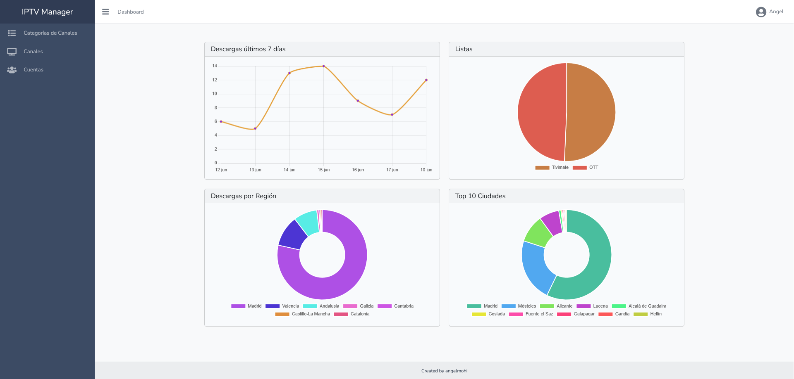

# IPTV Manager



## 📺 Descripción

IPTV Manager es una aplicación construida sobre Laravel que permite gestionar canales de televisión por IP. Con ella puedes importar canales y categorías desde archivos M3U, organizarlos, y generar listas de reproducción en formato **M3U** tanto desde la interfaz web como a través de comandos Artisan.

## ✨ Características

- Gestión de cuentas de usuario (creación, edición) y obtención de tokens CDN.
- Importación de canales (`import:channels`) y categorías (`import:channel-categories`) desde archivos M3U.
- Organización de canales por categorías.
- Generación de listas M3U con metadatos completos (tvg-id, tvg-name, tvg-logo, group-title, catchup).
- Descarga de listas para **TiviMate** y **OTT**.
- Interfaz web responsiva con Laravel Blade.
- Base de datos migrable y seeders incluidos.

## 🚀 Requisitos

- PHP >= 8.1
- Composer
- Node.js y npm (para activos frontend)
- MySQL, PostgreSQL o SQLite
- Extensiones PHP: BCMath, Ctype, Fileinfo, JSON, Mbstring, OpenSSL, PDO

## 📥 Instalación

1. Clona el repositorio:
   ```bash
   git clone https://github.com/angelmohi/iptv-manager.git
   cd iptv-manager
   ```
2. Instala dependencias PHP y frontend:
   ```bash
   composer install
   npm install
   npm run build
   ```
3. Copia el archivo de entorno y genera la clave de la aplicación:
   ```bash
   cp .env.example .env
   php artisan key:generate
   ```
4. Configura las variables de entorno en `.env`:
   ```ini
   APP_NAME=IPTV Manager
   APP_URL=http://localhost

   DB_CONNECTION=mysql
   DB_HOST=127.0.0.1
   DB_PORT=3306
   DB_DATABASE=iptv_manager
   DB_USERNAME=root
   DB_PASSWORD=

   # Token opcional para geolocalización de IPs
   IPINFO_TOKEN=tu_ipinfo_token
   ```
5. Ejecuta migraciones y seeders:
   ```bash
   php artisan migrate --seed
   ```
6. Inicia el servidor de desarrollo:
   ```bash
   php artisan serve
   ```
   Accede en `http://localhost:8000`

## ⚙️ Uso

### Interfaz Web

- **Cuentas**: `GET /accounts` → crear y editar usuarios.
- **Categorías**: `GET /channel-categories` → gestionar grupos de canales.
- **Canales**: `GET /channels` → añadir, editar, eliminar entradas.
- **Listas M3U**: en la sección **Listas**, pulsa **Actualizar** para regenerar todas las playlists.
- **Descarga de listas**:
  - TiviMate: `GET /lists/tivimate/{folder}`
  - OTT:       `GET /lists/ott/{folder}`

### Comandos Artisan

| Comando                             | Descripción                                                                                         |
| ----------------------------------- | --------------------------------------------------------------------------------------------------- |
| `php artisan import:channels`             | Importa todos los canales desde `storage/app/total_ott.m3u`, omitiendo líneas comentadas o inválidas. |
| `php artisan import:channel-categories`   | Importa títulos de grupos desde un archivo M3U al `channel_categories`, sin duplicados.                |
| `php artisan get-cdn-token`               | Obtiene el token CDN y lo actualiza en la configuración de almacenamiento.                           |
| `php artisan list`                        | Lista todos los comandos disponibles.                                                               |
