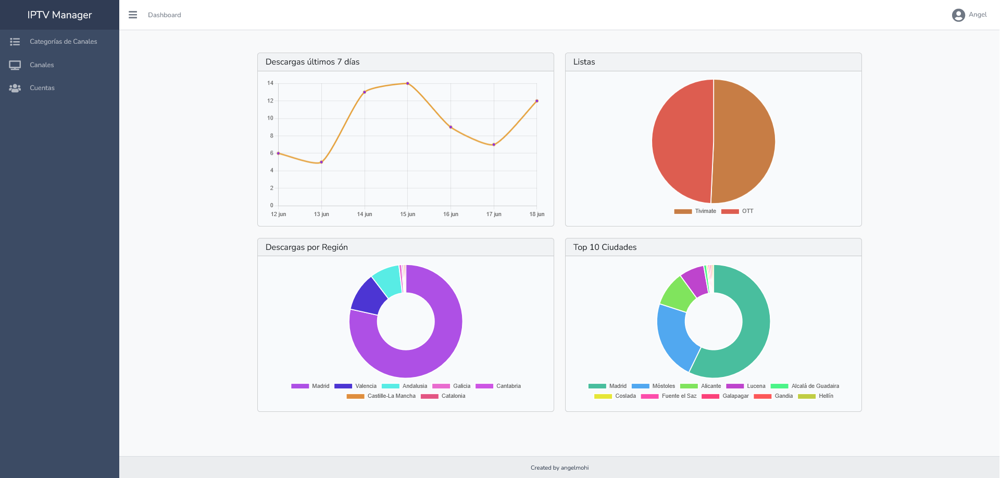
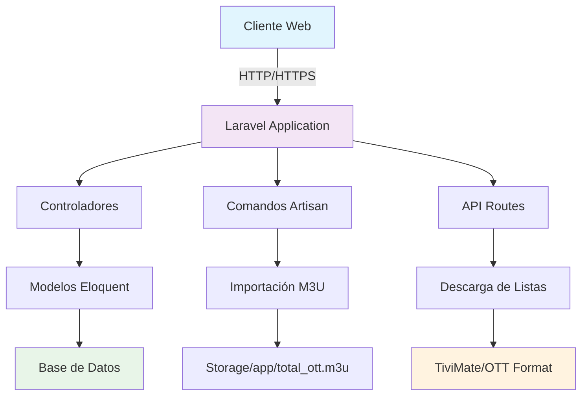

<div align="center">

# 📺 IPTV Manager

*Sistema completo de gestión de canales IPTV construido con Laravel*



[](https://laravel.com)
[](https://php.net)
[](https://getbootstrap.com)
[](https://chartjs.org)

---

</div>

## 📋 Tabla de Contenidos

- [📺 IPTV Manager](#-iptv-manager)
  - [📋 Tabla de Contenidos](#-tabla-de-contenidos)
  - [🌟 Descripción](#-descripción)
  - [✨ Características Principales](#-características-principales)
  - [🏗️ Arquitectura del Sistema](#️-arquitectura-del-sistema)
  - [🚀 Requisitos del Sistema](#-requisitos-del-sistema)
  - [📥 Instalación](#-instalación)
  - [⚙️ Configuración](#️-configuración)
  - [🎯 Uso del Sistema](#-uso-del-sistema)
    - [🖥️ Interfaz Web](#️-interfaz-web)
    - [🔧 Comandos Artisan](#-comandos-artisan)
  - [📊 Dashboard y Analytics](#-dashboard-y-analytics)
  - [🗂️ Estructura del Proyecto](#️-estructura-del-proyecto)
  - [🔧 Desarrollo](#-desarrollo)
  - [📱 API Endpoints](#-api-endpoints)
  - [🤝 Contribución](#-contribución)
  - [📄 Licencia](#-licencia)
  - [👨‍💻 Autor](#-autor)

## 🌟 Descripción

**IPTV Manager** es una aplicación web robusta y completa construida sobre **Laravel 10** que permite gestionar de manera eficiente canales de televisión por IP (IPTV). La aplicación ofrece una solución integral para la importación, organización y distribución de contenido IPTV con una interfaz moderna y funcional.

### 🎯 Objetivo Principal

Facilitar la administración centralizada de canales IPTV, permitiendo a los usuarios importar contenido desde archivos M3U, organizarlo por categorías y generar listas de reproducción optimizadas para diferentes plataformas de streaming.

## ✨ Características Principales

<div align="center">

| 🏷️ **Gestión de Cuentas** | 📺 **Administración de Canales** | 📊 **Analytics Avanzados** |
|:-:|:-:|:-:|
| • Creación y edición de usuarios<br>• Generación de tokens CDN<br>• Control de acceso seguro | • Importación masiva desde M3U<br>• Organización por categorías<br>• Gestión de metadatos completos | • Dashboard con métricas en tiempo real<br>• Gráficos interactivos con Chart.js<br>• Seguimiento de descargas por IP |

</div>

### 🔧 Características Técnicas

- **🚀 Framework**: Laravel 10.x con PHP 8.1+
- **🎨 Frontend**: Bootstrap 5 + CoreUI para una interfaz moderna
- **📊 Visualización**: Chart.js para gráficos interactivos
- **🗃️ Base de Datos**: Compatible con MySQL, PostgreSQL y SQLite
- **📱 Responsive**: Interfaz optimizada para dispositivos móviles
- **🔒 Seguridad**: Autenticación Laravel con middleware de protección
- **⚡ Performance**: Carga diferida y optimización de assets con Vite

### 📡 Funcionalidades IPTV

- **📥 Importación Inteligente**: Procesamiento automático de archivos M3U con validación
- **🏷️ Metadatos Completos**: Soporte para tvg-id, tvg-name, tvg-logo, group-title, catchup
- **📺 Múltiples Formatos**: Generación de listas para TiviMate y OTT
- **🔄 Sincronización**: Actualización automática de listas de reproducción
- **🛡️ Control Parental**: Gestión de contenido restringido
- **🎬 Catchup TV**: Soporte para televisión en diferido

## 🏗️ Arquitectura del Sistema


```mermaid
graph TD
    A[Cliente Web] -->|HTTP/HTTPS| B[Laravel Application]
    B --> C[Controladores]
    C --> D[Modelos Eloquent]
    D --> E[Base de Datos]
    B --> F[Comandos Artisan]
    F --> G[Importación M3U]
    G --> H[Storage/app/total_ott.m3u]
    B --> I[API Routes]
    I --> J[Descarga de Listas]
    J --> K[TiviMate/OTT Format]
    
    style A fill:#e1f5fe
    style B fill:#f3e5f5
    style E fill:#e8f5e8
    style K fill:#fff3e0
```

## 🚀 Requisitos del Sistema

### 📋 Requisitos Mínimos

| Componente | Versión Mínima | Recomendado |
|------------|----------------|-------------|
| **PHP** | 8.1 | 8.2+ |
| **Composer** | 2.0+ | Última versión |
| **Node.js** | 16+ | 18+ LTS |
| **NPM** | 8+ | 9+ |
| **MySQL** | 5.7+ | 8.0+ |

### 🔧 Extensiones PHP Requeridas

```bash
# Extensiones obligatorias
php-bcmath php-ctype php-fileinfo php-json php-mbstring 
php-openssl php-pdo php-tokenizer php-xml php-curl
```

### 💾 Bases de Datos Soportadas

- **MySQL** 5.7+ / 8.0+
- **PostgreSQL** 10+
- **SQLite** 3.8.8+
- **SQL Server** 2017+

## 📥 Instalación

### 🚀 Instalación Rápida

```bash
# 1. Clonar el repositorio
git clone https://github.com/angelmohi/iptv-manager.git
cd iptv-manager

# 2. Instalar dependencias PHP
composer install --optimize-autoloader --no-dev

# 3. Instalar dependencias Node.js
npm install

# 4. Configurar entorno
cp .env.example .env
php artisan key:generate

# 5. Configurar base de datos (editar .env)
nano .env

# 6. Ejecutar migraciones
php artisan migrate --seed

# 7. Compilar assets
npm run build

# 8. Iniciar servidor
php artisan serve
```

### 🔧 Instalación para Desarrollo

```bash
# Instalar dependencias con herramientas de desarrollo
composer install
npm install

# Compilar assets en modo desarrollo
npm run dev

# Ejecutar con recarga automática
npm run dev & php artisan serve
```

### 🐳 Instalación con Docker (Opcional)

```bash
# Usar Laravel Sail
./vendor/bin/sail up -d
./vendor/bin/sail artisan migrate --seed
```

## ⚙️ Configuración

### 🔧 Variables de Entorno Principales

```ini
# === APLICACIÓN ===
APP_NAME="IPTV Manager"
APP_ENV=production
APP_KEY=base64:...
APP_DEBUG=false
APP_URL=https://tu-dominio.com

# === BASE DE DATOS ===
DB_CONNECTION=mysql
DB_HOST=127.0.0.1
DB_PORT=3306
DB_DATABASE=iptv_manager
DB_USERNAME=iptv_user
DB_PASSWORD=tu_password_seguro

# === SERVICIOS EXTERNOS ===
IPINFO_TOKEN=tu_token_ipinfo_opcional

# === MAIL (OPCIONAL) ===
MAIL_MAILER=smtp
MAIL_HOST=smtp.mailtrap.io
MAIL_PORT=2525
MAIL_USERNAME=null
MAIL_PASSWORD=null

# === CACHE & SESSIONS ===
CACHE_DRIVER=file
SESSION_DRIVER=file
SESSION_LIFETIME=120
```

### 🛡️ Configuración de Seguridad

```bash
# Generar clave de aplicación
php artisan key:generate

# Configurar permisos de archivos
chmod -R 755 storage
chmod -R 755 bootstrap/cache

# Configurar enlaces simbólicos
php artisan storage:link
```

## 🎯 Uso del Sistema

### 🖥️ Interfaz Web

#### 📊 Dashboard Principal
- **URL**: `/`
- **Características**:
  - 📈 Gráficos de accesos únicos (últimos 7 días)
  - 🥧 Distribución de descargas por tipo de lista
  - 📊 Métricas de acceso por país y dispositivo
  - 🔄 Actualización en tiempo real

#### 👥 Gestión de Cuentas
- **URL**: `/accounts`
- **Funciones**:
  - ✏️ Crear y editar usuarios
  - 🔑 Generar tokens CDN automáticamente
  - 📋 Gestionar carpetas de listas personalizadas
  - 📥 Enlaces de descarga directa para TiviMate y OTT

#### 🏷️ Categorías de Canales
- **URL**: `/channel-categories`
- **Características**:
  - 📝 CRUD completo de categorías
  - 🔄 Reordenamiento drag & drop
  - 🗂️ Organización jerárquica
  - 🎨 Personalización visual

#### 📺 Administración de Canales
- **URL**: `/channels`
- **Funcionalidades**:
  - 📋 Lista completa con filtros avanzados
  - ✏️ Editor de metadatos completo
  - 🔄 Reordenamiento por categorías
  - 📋 Duplicación rápida de canales
  - 🛡️ Control parental

### 🔧 Comandos Artisan

#### 📥 Importación de Contenido

```bash
# Importar todos los canales desde archivo M3U
php artisan import:channels
# Archivo fuente: storage/app/total_ott.m3u
# Procesa: EXTINF, EXTVLCOPT, KODIPROP
# Omite: Líneas comentadas (##) y enlaces inválidos
```

```bash
# Importar categorías únicas desde M3U
php artisan import:channel-categories
# Extrae: group-title únicos
# Previene: Duplicados automáticamente
```

```bash
# Obtener y actualizar token CDN
php artisan get-cdn-token
# Función: Renovación automática de tokens
# Uso: Programable con cron jobs
```

#### 🔍 Comandos de Información

```bash
# Listar todos los comandos disponibles
php artisan list

# Ver ayuda detallada de un comando
php artisan help import:channels

# Verificar estado del sistema
php artisan about
```

#### ⚙️ Comandos de Mantenimiento

```bash
# Limpiar cachés del sistema
php artisan optimize:clear

# Optimizar para producción
php artisan optimize

# Ejecutar colas en background
php artisan queue:work
```

## 📊 Dashboard y Analytics

### 📈 Métricas Disponibles

<div align="center">

| 📊 **Métrica** | 📋 **Descripción** | 🔄 **Actualización** |
|:-:|:-:|:-:|
| **Accesos Únicos** | Usuarios únicos por día (últimos 7 días) | Tiempo real |
| **Distribución por Lista** | Preferencias TiviMate vs OTT | Automática |
| **Geolocalización** | Accesos por país (Focus en España) | Por solicitud |
| **Logs de Descarga** | Historial completo con IP tracking | Instantánea |

</div>

### 🎨 Visualizaciones Interactivas

- **📈 Gráfico Lineal**: Tendencias de acceso temporal
- **🥧 Gráfico Circular**: Distribución de preferencias
- **📊 Gráfico de Barras**: Comparativa por período
- **🗺️ Mapa de Calor**: Distribución geográfica (futuro)

## 🗂️ Estructura del Proyecto

```
iptv-manager/
├── 📁 app/
│   ├── 🎮 Console/Commands/      # Comandos Artisan personalizados
│   ├── 🛡️ Http/Controllers/     # Controladores web
│   ├── 🔧 Helpers/              # Clases auxiliares
│   ├── 📊 Models/               # Modelos Eloquent
│   └── 🛠️ Providers/           # Proveedores de servicios
├── 📁 database/
│   ├── 🏭 factories/           # Factories para testing
│   ├── 🗂️ migrations/         # Migraciones de BD
│   └── 🌱 seeders/            # Seeders de datos
├── 📁 public/
│   ├── 🎨 assets/             # Assets estáticos
│   │   ├── 🖼️ img/           # Imágenes
│   │   ├── 🎨 css/           # Hojas de estilo
│   │   └── ⚡ js/            # JavaScript
│   └── 🏠 index.php          # Punto de entrada
├── 📁 resources/
│   ├── 🎨 sass/              # Archivos SCSS
│   ├── ⚡ js/                # JavaScript fuente
│   └── 🖼️ views/            # Templates Blade
├── 📁 routes/
│   ├── 🌐 web.php            # Rutas web
│   ├── 📡 api.php            # Rutas API
│   └── 🖥️ console.php       # Rutas de consola
├── 📁 storage/
│   ├── 📱 app/               # Archivos de aplicación
│   │   └── 📺 total_ott.m3u # Archivo M3U principal
│   └── 📝 logs/             # Logs del sistema
├── 📦 composer.json          # Dependencias PHP
├── 📦 package.json           # Dependencias Node.js
├── ⚙️ vite.config.js         # Configuración Vite
└── 📚 README.md              # Documentación
```

## 🔧 Desarrollo

### 🛠️ Stack Tecnológico

```yaml
Backend:
  Framework: Laravel 10.x
  Language: PHP 8.1+
  Database: MySQL/PostgreSQL/SQLite
  Queue: Redis/Database
  
Frontend:
  Framework: Bootstrap 5.2
  UI Kit: CoreUI
  Charts: Chart.js
  Build Tool: Vite
  Icons: FontAwesome 5.15
  
Development:
  Package Manager: Composer + NPM
  Testing: PHPUnit
  Code Style: Laravel Pint
  Debug: Laravel Telescope (opcional)
```

### 🧪 Testing

```bash
# Ejecutar todos los tests
php artisan test

# Tests con cobertura
php artisan test --coverage

# Tests específicos
php artisan test --filter=ChannelTest
```

### 🎨 Estilo de Código

```bash
# Formatear código automáticamente
./vendor/bin/pint

# Verificar estilo sin cambios
./vendor/bin/pint --test
```

### 🚀 Deployment

```bash
# Optimizar para producción
composer install --optimize-autoloader --no-dev
npm run build
php artisan optimize
php artisan config:cache
php artisan route:cache
php artisan view:cache
```

## 📱 API Endpoints

### 🔗 Endpoints Principales

```http
# Descarga de listas IPTV
GET /lists/tivimate/{folder}
GET /lists/ott/{folder}

# Actualización de listas
POST /lists/update

# Gestión de cuentas
GET    /accounts
POST   /accounts
PUT    /accounts/{id}
POST   /accounts/{id}/generate-token

# Administración de canales
GET    /channels
POST   /channels
PUT    /channels/{id}
DELETE /channels/{id}
POST   /channels/reorder
POST   /channels/{id}/duplicate

# Categorías
GET    /channel-categories
POST   /channel-categories
PUT    /channel-categories/{id}
DELETE /channel-categories/{id}
POST   /channel-categories/reorder
```

### 📊 Respuestas API

```json
{
  "status": "success",
  "data": {
    "channels": [
      {
        "id": 1,
        "name": "Canal Ejemplo",
        "tvg_id": "canal-ejemplo",
        "logo": "https://example.com/logo.png",
        "category": "Entretenimiento",
        "url_channel": "https://stream.example.com/live.m3u8"
      }
    ]
  },
  "meta": {
    "total": 150,
    "per_page": 50,
    "current_page": 1
  }
}
```

## 🤝 Contribución

### 🎯 Cómo Contribuir

1. **🍴 Fork** el repositorio
2. **🌿 Crea** una rama para tu feature (`git checkout -b feature/nueva-funcionalidad`)
3. **💾 Commit** tus cambios (`git commit -am 'Añadir nueva funcionalidad'`)
4. **📤 Push** a la rama (`git push origin feature/nueva-funcionalidad`)
5. **🔄 Crea** un Pull Request

### 📋 Estándares de Contribución

- **🧪 Testing**: Incluir tests para nuevas funcionalidades
- **📚 Documentación**: Actualizar README si es necesario
- **🎨 Estilo**: Seguir PSR-12 para PHP y StandardJS para JavaScript
- **📝 Commits**: Usar mensajes descriptivos en español

### 🐛 Reportar Issues

Usa la plantilla de issues para reportar bugs:

```markdown
**Descripción del Bug**
Descripción clara y concisa del problema.

**Pasos para Reproducir**
1. Ir a '...'
2. Hacer clic en '...'
3. Ver error

**Comportamiento Esperado**
Descripción de lo que debería pasar.

**Entorno**
- OS: [ej. Windows 11]
- PHP: [ej. 8.1.2]
- Laravel: [ej. 10.48.4]
```

<div align="center">

**⭐ Si este proyecto te ha sido útil, considera darle una estrella ⭐**

Hecho con ❤️ por [angelmohi](https://github.com/angelmohi)

</div>
